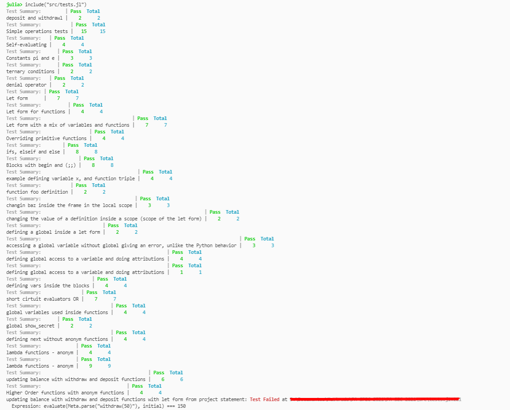

# PA-SPEC-2021

## Running

To run this code, you have several tests defined in the [Tests file](src/tests.jl), present in the src.

``` include("src/tests.jl") ```

The implementation of the REPL-like is in the [IO file](src/io.jl), just run the repl() function, or run the file in the julia REPL with:

``` include("src/repl.jl") ```

## Tests

  

Only the last test is failing, the implementation was not completed.

## Implementation

The implementation of the evaluator is split between the [Eval](src/eval.jl), [Predef](src/predef.jl) e [Utils](src/utils.jl).

_________

## Developed By

- Hugo Martins, IST, July 2021
